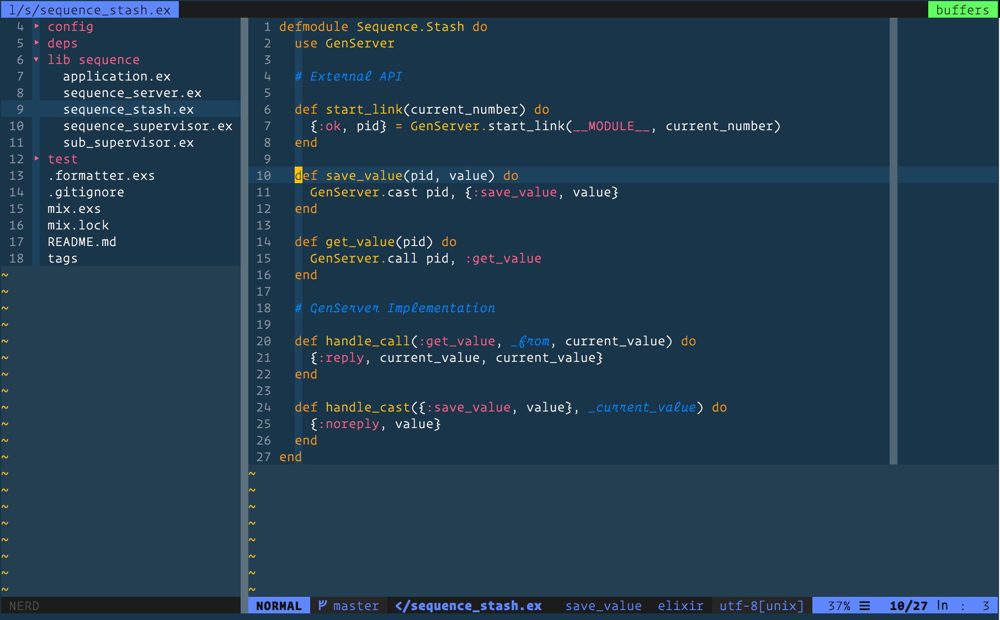

## vim-cobalt2

Color theme to improve readability on devices. Requires a 256 color terminal.
Port from cobalt2 theme of Wes Bos for VIM.

Place the `cobalt2.vim` / `cobalt2-gui` files under `~/.vim/colors`

Alternatively, if using a plugin manager e.g [Vundle](https://github.com/VundleVim/Vundle.vim)

Bundle ‘arcseldon/vim-cobalt2’

For GUI based VIM editors, e.g MacVim (mvim), then place the following in .vimrc

Set `guifont` to your favourite font - recommend Operator Mono.

```
if has('gui_running')
  source $HOME/.vim/bundle/vim-cobalt2/colors/cobalt2-gui.vim
  set guifont=Operator\ Mono:h12

  highlight Comment gui=italic
  highlight Comment cterm=italic

  highlight htmlArg gui=italic
  highlight htmlArg cterm=italic
endif
```

## Example




